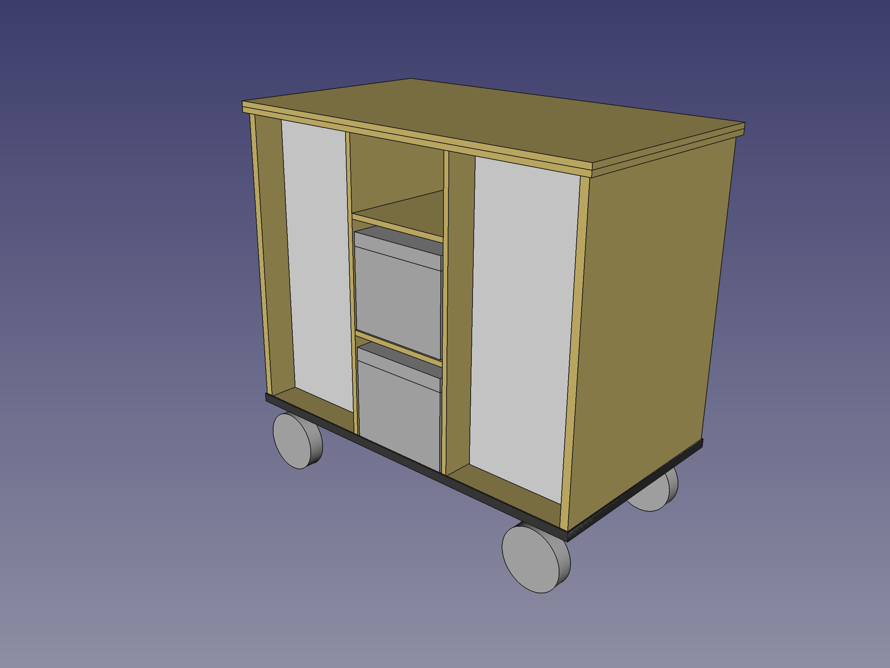
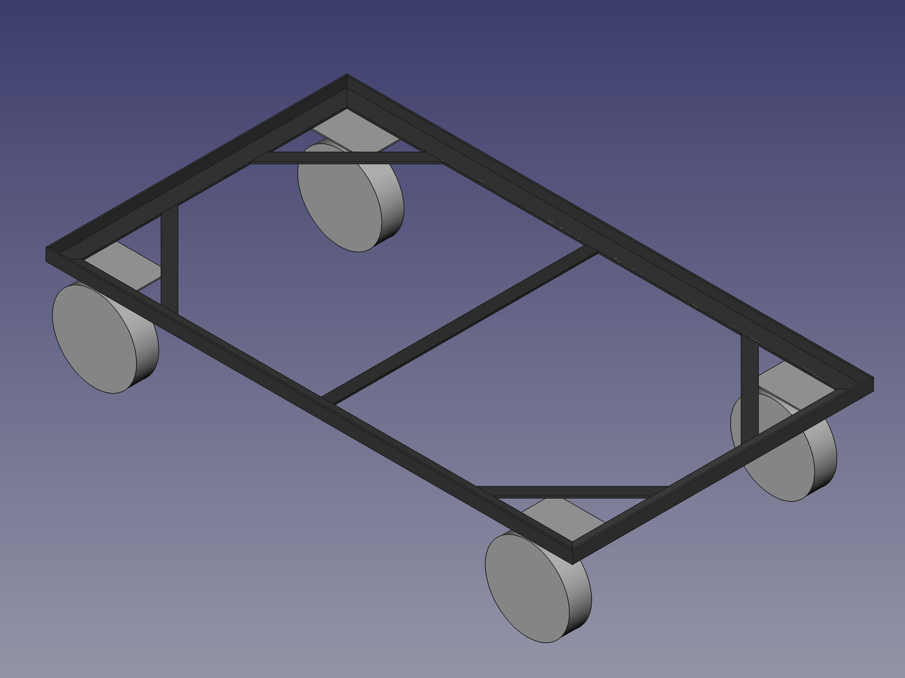

## HELMER Werkzeugwagen
### Ein fahrbarer Werkzeugwagen mit zwei IKEA-HELMER Schubladenelementen

Der Korpus besteht aus 12 und 18 mm Birke-Multiplex und wird durch verleimte Flachdübel zusammengehalten.

Für ausreichend Stabilität beim Herumfahren sorgt ein Rahmen aus Stahlprofilen:

Abmessungen: ca. 90 cm × 50 cm × 85 cm.

Die 2D-Zeichnungen (`*.dxf`) lassen sich z. B. mit [LibreCAD](http://librecad.org/) öffnen, das 3D-CAD-File (`*.fcstd`) mit [FreeCAD](http://www.freecadweb.org/).

#### Lizenz

 
Dieses Werk ist lizenziert unter einer [Creative Commons Namensnennung - Weitergabe unter gleichen Bedingungen 4.0 International Lizenz](http://creativecommons.org/licenses/by-sa/4.0/).

 

